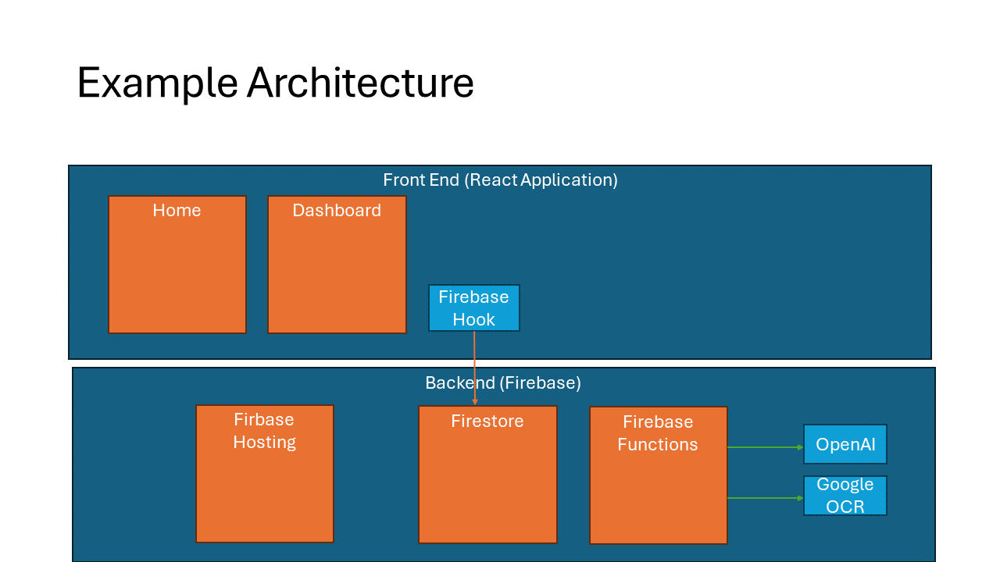

Draw a diagram of the main components of your application. A generic 394 application looks a bit like this:

The PPT I used to create this is in the google drive for the class for you to use as a base. It must be saved as an image to be uploaded to the project documentation.

